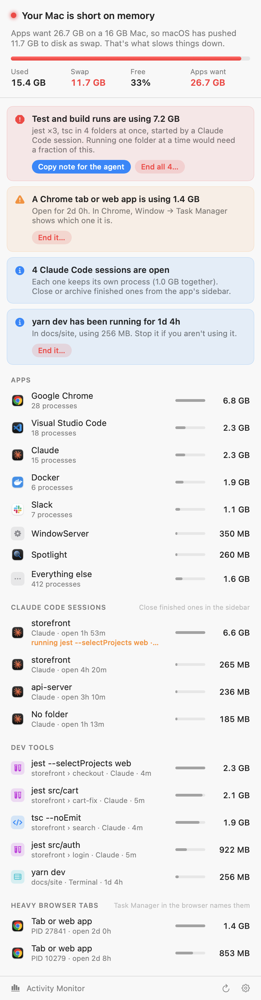
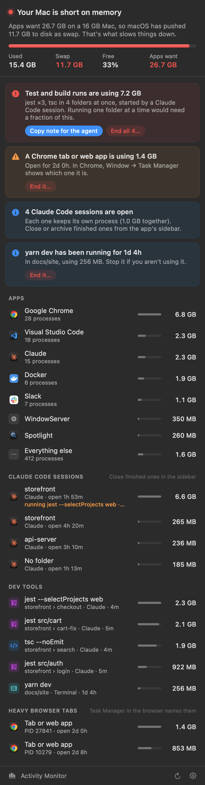

<p align="center"></p>

<h1 align="center">Headroom</h1>

<p align="center">A macOS menu bar app that tells you what's eating your RAM, and what to do about it.</p>

---

Activity Monitor lists hundreds of processes. When your Mac starts swapping, what you actually need to know is *which thing you started* is responsible: four test runs going at once in different worktrees, a dev server you forgot about, a 1.4 GB browser tab, or a few AI coding sessions each holding memory. Headroom groups processes into those things and points at the fix.

<p align="center">
  
  &nbsp;
  
</p>

## What it shows

- **Status in the menu bar.** A memory chip with the percentage used. It stays monochrome while memory is healthy and turns orange or red when it gets tight.
- **The real numbers.** Memory used, swap, free percentage, and, when apps want more than fits, how much they're asking for in total.
- **Problems first, each with a fix:**
  - Test and build runs piling up (jest, vitest, tsc, webpack, and similar), including across git worktrees. If a coding agent started them, **Copy note for the agent** puts a ready-made "run one thing at a time" message on your clipboard.
  - Processes left running after whatever started them has exited.
  - A browser tab or web app using more than 1 GB (Chrome and other Chromium browsers).
  - Several Claude desktop apps, or many Claude Code sessions, open at once.
  - Dev servers that have been running for more than 12 hours.
  - Leftover swap that macOS will clear on its own, so you know not to worry about it.
- **Where the memory is:** apps (with their helper processes grouped in), Claude Code sessions (by folder, with what each one is running), dev tools (by project and worktree, and what launched them), and heavy browser tabs.
- **Fixes in place.** Hover over a row to quit an app or end a process. Every action asks first, and Headroom checks a process's start time before ending it, so a reused process ID is never hit by mistake.
- An optional notification when memory runs short, and an option to launch at login.

## Install

You need macOS 14 or later and either the Xcode Command Line Tools (`xcode-select --install`) or Xcode.

```bash
git clone https://github.com/Aadhar-Gupta/headroom.git
```

```bash
cd headroom && ./build.sh install
```

This builds a universal app (Apple silicon and Intel), copies it to `~/Applications`, and launches it. There are no dependencies. Right-click the menu bar icon, or click the gear in the panel, for settings such as Launch at Login.

## How it works

- **System numbers:** `host_statistics64` for memory used (app memory + wired + compressed, the same as Activity Monitor's "Memory Used"), `vm.swapusage` for swap, and `kern.memorystatus_level` / `kern.memorystatus_vm_pressure_level` for the free percentage and pressure level that `memory_pressure` reports.
- **Per-process memory:** `proc_pid_rusage` phys_footprint, the "Memory" column in Activity Monitor and `top`. It includes pages that have been compressed or swapped out, which is why apps can "want" more than your Mac has.
- **Who started what:** the process tree from `sysctl(KERN_PROC_ALL)`, arguments from `KERN_PROCARGS2`, and working directories from `proc_pidinfo`. That's how helpers are grouped into their app, a jest worker is traced back to the terminal or Claude Code session that launched it, and runs are labelled by worktree.
- **Cost:** it checks every 10 seconds in the background, and every 3 seconds while the panel is open. A full check takes about 10 ms. Headroom only reads your own processes, needs no special permissions, and makes no network connections.

## Command line

The app binary also prints and renders reports, which is handy for scripts and for working on the UI:

```bash
~/Applications/Headroom.app/Contents/MacOS/Headroom --dump
```

- `--dump` prints the same report as the panel.
- `--dump --demo` prints a sample Mac that's short on memory.
- `--render out.png [--demo] [--dark]` draws the panel to an image.

## Limitations

- Memory of processes owned by other users (system daemons such as WindowServer) can't be read without root, so the "Apps want" total covers your processes only.
- Browser tabs are identified by process, not by title. The panel says how long each one has been open, and the browser's own Task Manager names it.
- If you build with only the Command Line Tools, `build.sh` uses their macOS 26 SDK when available, because SwiftUI in the macOS 27 SDK needs a compiler plugin that only ships with Xcode.

## License

[MIT](LICENSE)
